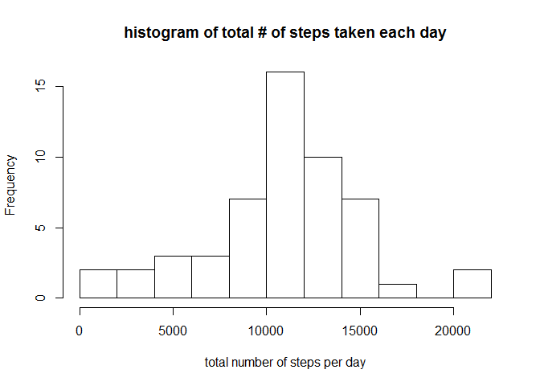
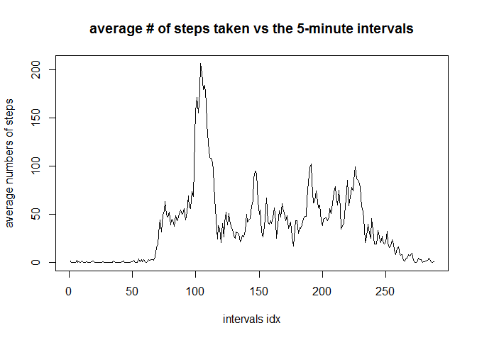
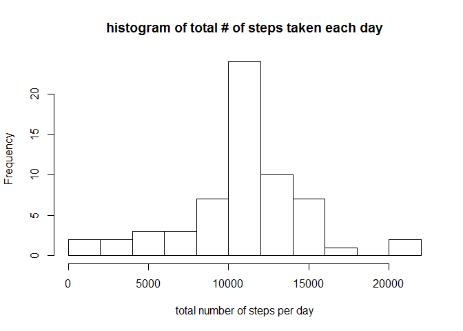
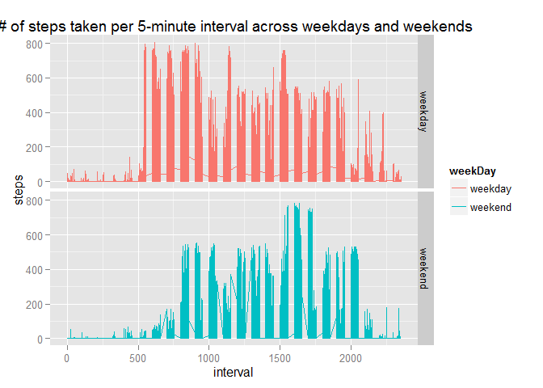

# Reproducible Research: Peer Assessment 1


## Loading and preprocessing the data
Firstly, data is unziped and extracted to the variable named activityData.

```r
#unzip and load content to activityData
unzip("activity.zip")
activityData <- read.table("activity.csv", sep=",", header = TRUE)
```


***
## What is mean total number of steps taken per day?
Create histgram of total number of steps taken each day.
Its average and mean is almost the same.

```r
#create histogram of steps per date
perDay <- tapply(activityData$steps, activityData$date, sum)
hist(perDay, main="histogram of total # of steps taken each day", xlab="total number of steps per day", breaks=10)
```

 

```r
#median and mean
summary(perDay)[3:4]
```

```
## Median   Mean 
##  10760  10770
```


***
## What is the average daily activity pattern?
The graph shows activity pattern of a day.
Number of steps has peek in the morning.

```r
#create lineplot of steps per interval
perInt <- tapply(activityData$steps, activityData$interval, mean, na.rm=T)
plot(perInt, type="l", main="average # of steps taken vs the 5-minute intervals", xlab="intervals idx", ylab="average numbers of steps")
```

 

```r
#biggest step value is obtained in the morning
names(which.max(perInt))
```

```
## [1] "835"
```


***
## Imputing missing values
There are some missing values in the dataset.
I've imputed them by the average of the daily activity pattern which is calculated in the previous section.
Statistical parameters are not so affected, but histogram shows that there seems less variability in the graph.

```r
#impute missing value using by the mean for the 5-minute interval
#imputed data are named newData
sum(is.na(activityData$steps))
```

```
## [1] 2304
```

```r
newData <- activityData
for(j in 1:length(activityData$steps)){
    i<-activityData$steps[j]
    if(is.na(i)) newData$steps[j] <- perInt[j%%length(perInt)+1]
}
perDay2 <- tapply(newData$steps, newData$date, sum)
hist(perDay2, main = "histogram of total # of steps taken each day", xlab="total number of steps per day", breaks=10)
```

 

```r
summary(perDay2)[3:4] #median and mean
```

```
## Median   Mean 
##  10770  10770
```


***
## Are there differences in activity patterns between weekdays and weekends?
2 graphs are shown, one is an average in weekdays and the other is in weekends. The graph shows this user wakes up later in the morning compared to weekdays.

```r
# set locale to "C", this is used for the people who use R in non-English language like me. 
Sys.setlocale("LC_TIME","C")
```

```
## [1] "C"
```

```r
# data are separated to two factors, "weekday" and "weekend"
newData$weekDay <- ifelse(weekdays(as.Date(newData$date)) %in% c("Saturday", "Sunday"),"weekend","weekday")
newData$weekDay <- as.factor(newData$weekDay)

#draw a graph using ggplot2 system
library(ggplot2)
qplot(interval, steps, data=newData, geom=c("line"), facets=weekDay~., color=weekDay, main=" # of steps taken per 5-minute interval across weekdays and weekends")
```

 
